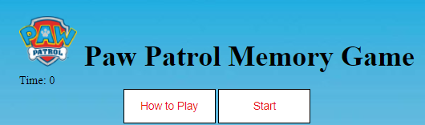
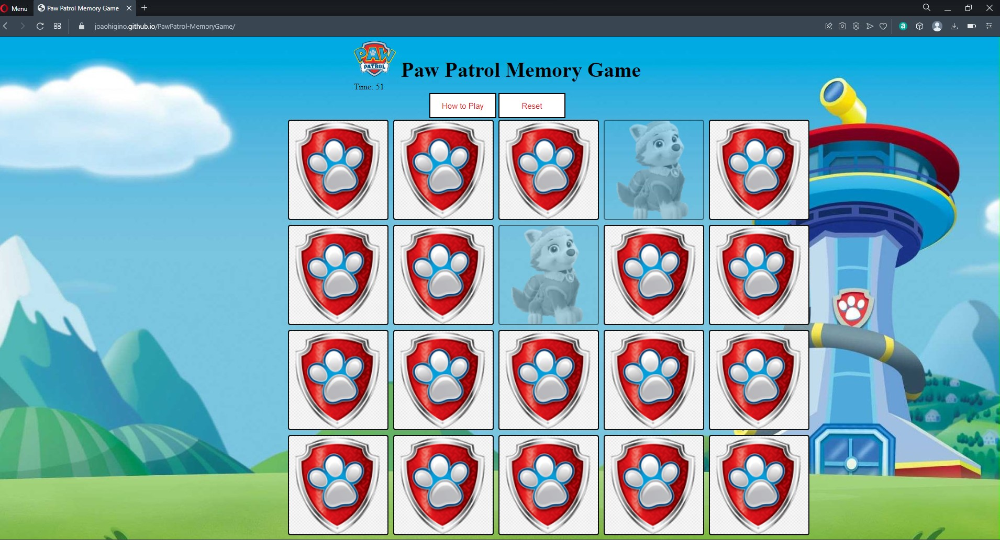
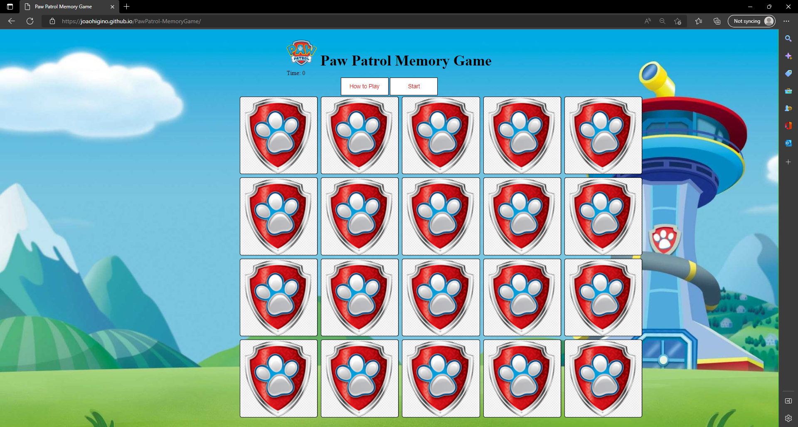
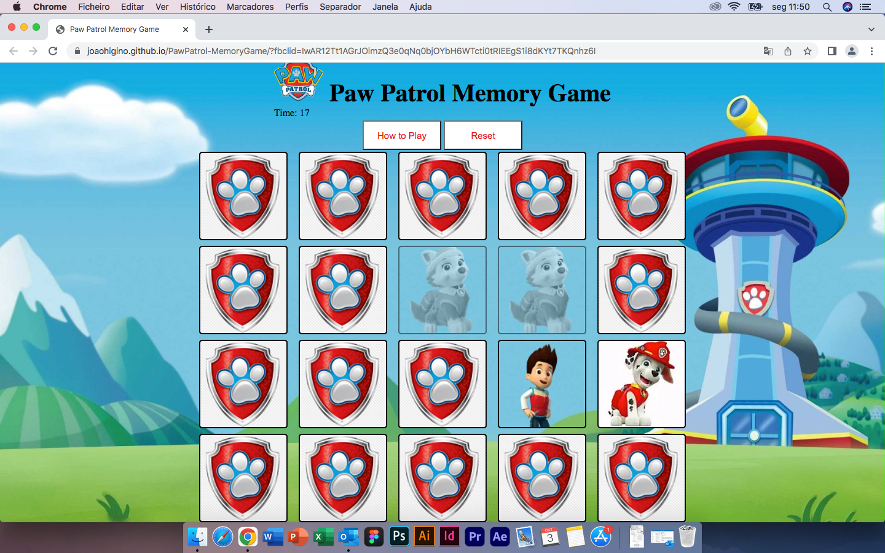
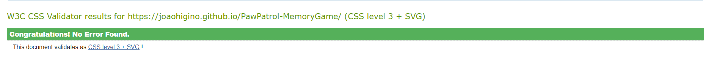
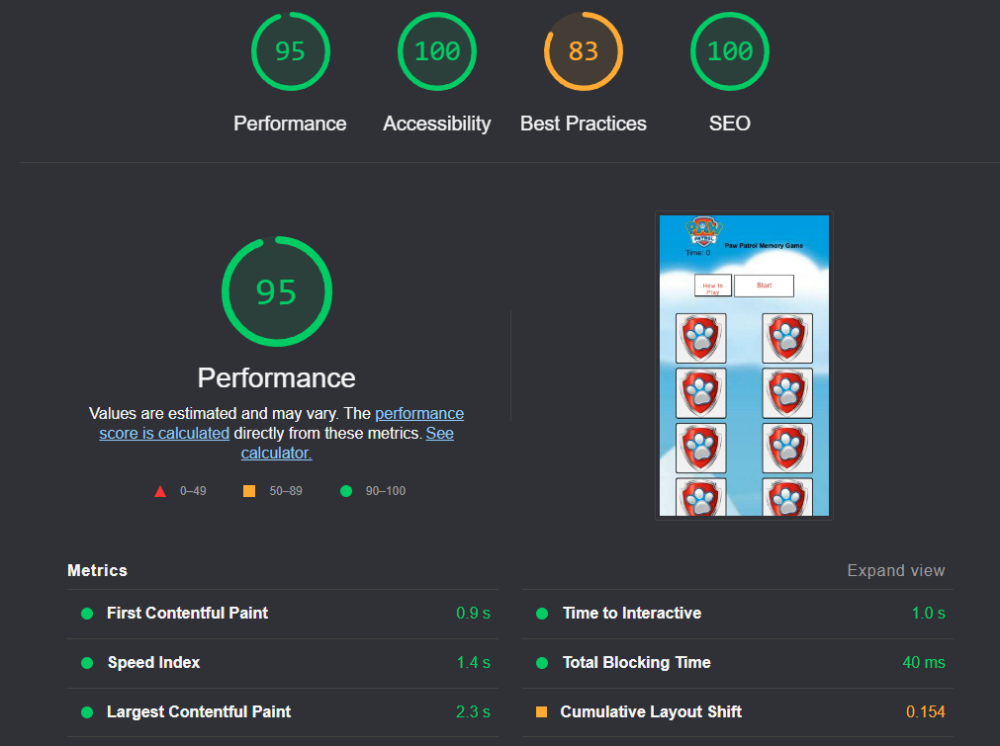

# Paw Patrol Memory Game

A memory game also called concentration is a game in which all of the cards are laid face down on a surface and two cards are flipped face up over each turn. The object of the game is to turn over pairs of matching cards. Paw Patrol memory game is a game using paw patrol characters to match 10 pairs. 

### Existing Features

- __Header__

  - Featured the game logo, the game timer, and the how-to-play and reset buttons. 

- __How to Play button__

  - When clicked will open a pop-up window with the rules. 
  

- __How to Play pop-up__

  - When clicked How to play button will show up all the rules, how to win the game and the commercial intention.

- __Reset button__

  - This button will reset the game to and start it again.  

### Features Left to Implement

- Create a player every time the game starts and create a leaderboard with the results. 

## Technologies Used

- [HTML5](https://en.wikipedia.org/wiki/HTML5)
- [CSS3](https://en.wikipedia.org/wiki/Cascading_Style_Sheets)
- [JavaScript](https://en.wikipedia.org/wiki/JavaScript)
- [Wikipedia](https://en.wikipedia.org/wiki/Concentration_(card_game))- was used to check the memory game rules
- [Gitpod](https://www.gitpod.io) - was used to create the website
- [Github](https://github.com) - was used to store repository of website and deploy the website
- [Chrome Dev Tools](https://developer.chrome.com/docs/devtools) - was used to view and experiment with styles
- [Google Fonts](https://fonts.google.com) - was used to find the fonts for the website
- [Pexels](https://www.pexels.com) - provided the images seen throughout the website
- [Grammarly](https://app.grammarly.com) - was used to check typography.
- [Am I Responsive](https://ui.dev/amiresponsive?url=https://joaohigino.github.io/CHANGE/) - was used to produce the website mockup.
- [JSHint](https://jshint.com/) - was used to 

## Browser testing

 - Chrome

 
 - Opera

 
 - Edge

 
 - Safari

 

## Mobile Testing 

- The website was viewed on a variety of devices such as desktops, Laptops, Apples Products and a range of Android devices:

  - Iphone 12

  
   
  - Motorola Edge 20 Lite

  
   
  - Samsung Galaxy A13

  
   
  - One Plus 9

  
   
  - Huawei Y5P

  
   

### Validator Testing 

- HTML

  - No errors were returned when passing through the official
  

- CSS

  - No errors were found when passing through the official
  
  
- Lighhouse

  - The site scored well

  

## Unfixed Bugs

No unfixed bugs that i am aware.

## Deployment

The site was deployed to GitHub pages. The steps to deploy are as follows: 
  - In the [GitHub repository](https://github.com/JoaoHigino/PawPatrol-MemoryGame), navigate to the Settings tab 
  - From the source section drop-down menu, select the **Main** Branch, then click "Save".
  - The page will be automatically refreshed with a detailed ribbon display to indicate the successful deployment.

The live link can be found [here](https://joaohigino.github.io/PawPatrol-MemoryGame/)

### Local Deployment

In order to make a local copy of this project, you can clone it. In your IDE Terminal, type the following command to clone my repository:

- `git clone https://github.com/JoaoHigino/PawPatrol-MemoryGame.gitX`

Alternatively, if using Gitpod, you can click below to create your own workspace using this repository.

## **Content**

All content was written by developer. 

## Acknowledgements

- To my amazing wife Sandra, my best friend, my mentor, and my safe haven, without her, all my dreams will be impossible to achieve. She is everything.
- To my two kids, Maria and Thomas, with them life is easy and light. They make me laugh and think that our future is bright. 
- To my family and friends - for being a great support and providing a lot of the user testing for me, especially my friends from "Liga 7 BP" with their craziness helped me to clean my head.
- To my mentor Tim Nelson for all his guidance, support, tips, and feedback.
- The Code Institute community on slack and my classmates its been a pleasure so far.